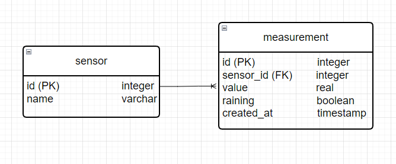
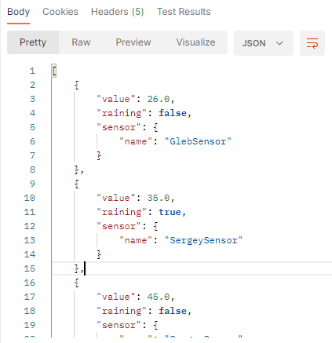
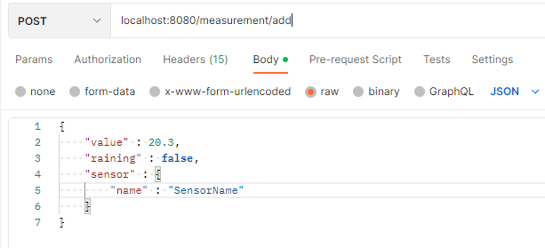
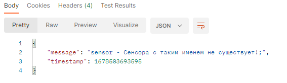

# Restfull API Service
## Обзор
RESTful API сервис, принимающий данные от метеорологического сенсора.  

### Сервис реализует:
*  регистрацию новых сенсоров в системе (добавляет сенсор в БД).
Также валидируется то, что сенсор имеет уникальное название, а если происходит попытка добавления уже существующего сенсора
клиенту возвращается сообщение с ошибкой;
*  добавление измерений в БД;
*  предоставление всех измерений из БД;
* предоставляет количество дождливых дней из БД.

### Описание базы данных:
Было создано две таблицы - measurement (хранит данные об измерениях) и sensor (хранит данные о сенсорах).

Между таблицами организованна связь один ко многим. 

### Использованные технологии
* Java 17
* Spring Boot
* Spring REST
* Spring Validator
* JUnit
* Mockito
* PostgreSQL

## Запуск

### С помощью Git
Склонировать репозиторий, выполнив команду -

`git clone https://github.com/Esthete9/weatherSensorService.git`

Так как данный сервис взаимодействует с базой данных (СУБД - PostgreSQL), для его запуска необходимо создать ее вместе с таблицами.
Для быстрой настройки в корне проекта лежит dump БД (файл - dump.sql)   

*  1 - Создать новую базу данных. Для этого:

     - перейти в каталог bin выполнив команду `cd C:\Program Files\PostgreSQL\11\bin`

       (путь к каталогу может отличаться);

    -  выполнить команду `createdb -U postgres testdb` (где postgres суперпользователь, testdb новая база данных);
   
    -  далее выполнить команду `psql -U postgres -d new_db -f ПУТЬ ДО ФАЙЛА С ДАМПОМ` после этого дамп будет импортирован.

* 2 - Перейти в каталог `\weatherSensorService\src\main\resources` в нем, с помощью текстового редактора, открыть файл `application.properties`

    и внести свои данные в переменные:

  - spring.datasource.url=свои данные; 
  - spring.datasource.username=свои данные;
  - spring.datasource.password=свои данные.

* 3 - Далее перейти в корневую папку проекта и выполнить команду -

`mvn spring-boot:run`

## Endpoints
`GET /measurement` -
### Возвращает все измерения.

В случае размещения приложения на порте 8080, запрос будет выглядеть:
**localhost:8080/measurement** - все остальные запросы строятся аналогично.

#### Пример ответа:
##### JSON

---
`GET /measurement/rainyDaysCount`
### Возвращает количество дождливых дней.
#### Ответ:

`4`

 ---
`POST /measurement/add`
### Добавляет измерение в базу данных.
#### Параметры:
`MeasurementDTO measurementDTO` - измерение отправеленное сенсером.
#### Пример отправлеямых данных:

#### Ответ:
в случае успеха - `OK`;

в случае если сенсора с таким именем не существует - 

---